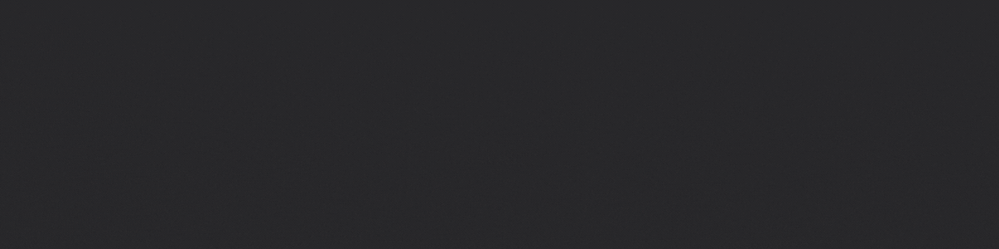

   #                    👋Hi there, I am Radi,

<!--
**Radi-dev/Radi-dev** is a ✨ _special_ ✨ repository because its `README.md` (this file) appears on your GitHub profile.

Here are some ideas to get you started:

- 🔭 I’m currently working on ...
- 🌱 I’m currently learning ...
- 👯 I’m looking to collaborate on ...
- 🤔 I’m looking for help with ...
- 💬 Ask me about ...
- 📫 How to reach me: ...
- 😄 Pronouns: ...
- ⚡ Fun fact: ...
-->
 

### About Me:
- Fullstack developer
- I enjoy writing scripts in Python
- I love learning new things

### Find Me:

### My Tech Stack:

   
   

                    
